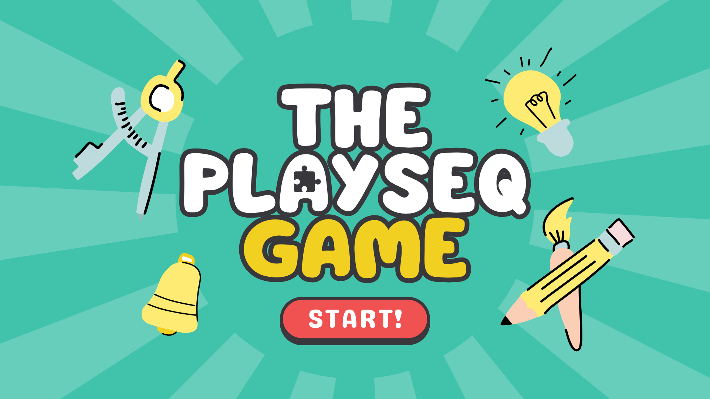

# PCS3635 – Digital Laboratory I

This repository contains the Verilog-based projects developed during the PCS3635 course at Poli USP, focused on learning and implementing digital circuits on FPGAs.

## 📁 Folder Structure

### `experiment_N` (Weeks 1–7)

These folders contain the weekly experiments developed throughout the course. Each week builds on the last, culminating in a full implementation of the classic **Genius game** (a memory sequence game) using **Verilog only**, targeting FPGA platforms.

The weekly progression covers key digital logic design concepts, including:
- Combinational logic
- Sequential circuits
- Finite state machines (FSMs)
- Clock dividers and counters
- Datapath and control unit design

---

### `semana_N` (PlaySeq Project)

These folders document the development of **PlaySeq**, a customized version of the Genius game created to assist **children on the autism spectrum** in developing **logical reasoning** through interactive gameplay.

#### 💡 Project Timeline:
- **Week 0** – Planning and research  
  - Understanding our client’s needs
  - Studying autism spectrum disorders (ASD)
  - Defining pedagogical adaptations
- **Weeks 1–4** – Implementation  
  - Verilog-based logic design
  - FPGA integration
  - Hardware interface construction
  - Visual identity and player manual creation

The **final version** of the PlaySeq game can be extracted from the [`playseq_final.qar`](./playseq_final.qar) file located at the root of the repository.

  

---

## 📄 Documentation

Each week includes:
- **Planning Report** (before lab implementation)
- **Final Report** (after the lab session)

All weekly reports and sandbox project files:  
📂 [Google Drive – PCS3635](https://drive.google.com/drive/folders/1-doGEk03lN08pOinlktC5XwPkQwppnl2?usp=sharing)

These reports contain:
- Datapath and control unit diagrams
- Reasoning behind design decisions
- Comprehensive ModelSim test outputs and analysis

---

## 📺 Video Demonstrations

🧪 Detailed weekly tests and results are demonstrated in this unlisted playlist:  
▶️ [YouTube Playlist – Weekly Tests](https://www.youtube.com/playlist?list=PLVnyiOg1rB7cQuaoBw2ko2DIo78hjmx3q)

🎬 Main demo video of the PlaySeq project:  
**🔗 [Watch the main PlaySeq demonstration](https://youtu.be/u7cLGeLNcNw)**

---

## 🛠️ Tools & Technologies

- **Verilog HDL**
- **ModelSim** – simulation and waveform analysis
- **Quartus Prime** – synthesis and FPGA programming
- **DE10-Lite** – FPGA development board

---

## 👥 Authors

Developed by the students Heitor Gama, Ana Vitória Murad and Yasmin Francisquetti from Poli USP as part of the PCS3635 – Digital Laboratory I course.

